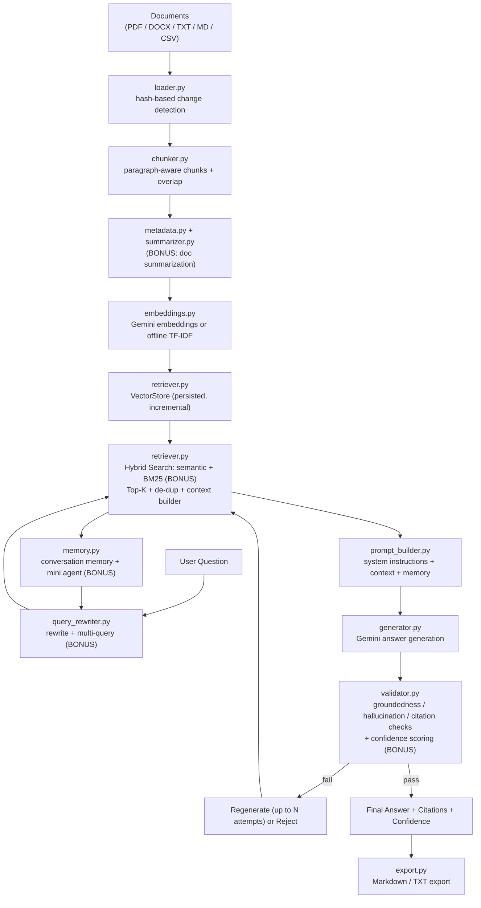

# Architecture

See `architecture_diagram.png` for the rendered diagram. Source (Mermaid,
renders natively on GitHub) is below.

## Component responsibilities

| Layer | Module(s) | Responsibility |
|---|---|---|
| Ingestion | `knowledge_base/loader.py` | Load PDF/DOCX/TXT/MD/CSV, detect new/changed files via content hash |
| Ingestion | `knowledge_base/chunker.py` | Paragraph-aware chunking with overlap, chunk numbering |
| Ingestion | `knowledge_base/metadata.py`, `knowledge_base/summarizer.py` | Document metadata + BONUS summarization during indexing |
| Indexing | `embeddings.py` | Gemini embeddings (production) or offline TF-IDF (fallback) |
| Indexing | `retriever.py` (`VectorStore`) | Persistent vector store, incremental add, BM25 index |
| Query time | `query_rewriter.py` | Query rewriting, coreference resolution, BONUS multi-query |
| Query time | `retriever.py` (`hybrid_search`) | BONUS hybrid semantic+keyword search, Top-K, dedupe, context builder |
| Query time | `memory.py` | Conversation memory, BONUS retrieval-vs-memory agent |
| Generation | `prompt_builder.py` | System instruction + context + memory assembly |
| Generation | `generator.py` | Gemini answer generation (offline extractive fallback) |
| Validation | `validator.py` | Groundedness / hallucination / citation checks, BONUS confidence scoring |
| Output | `export.py` | Conversation export to Markdown / TXT |
| Evaluation | `evaluation.py` | Runs eval question set, BONUS automatic report generation |
